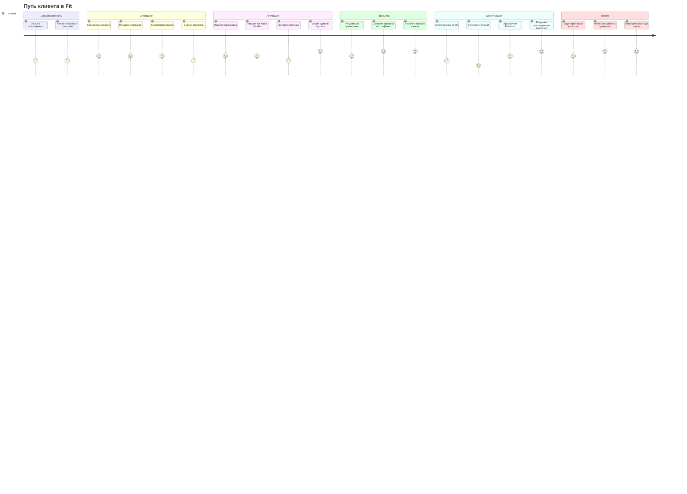
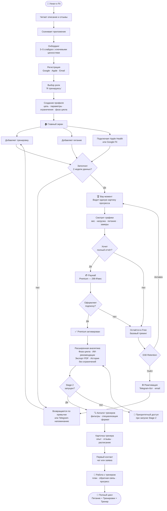
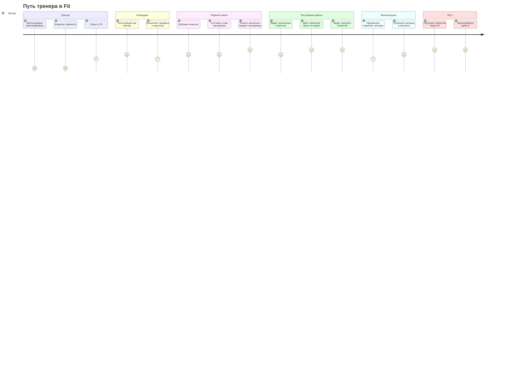
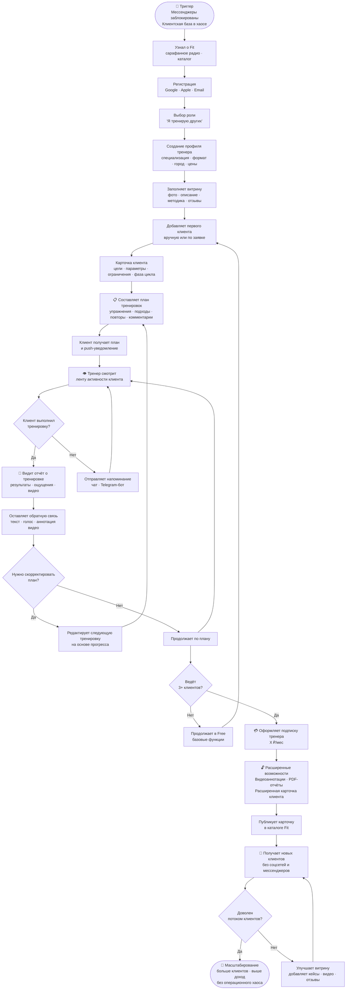
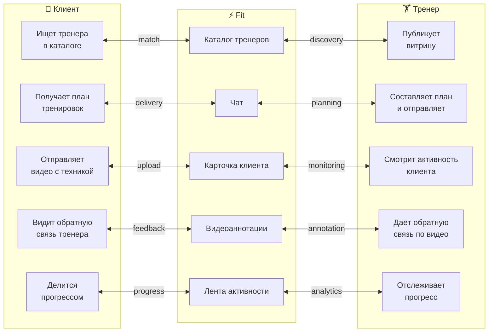

# Customer Journey Map — Fit

> Карта пути пользователя для двух ролей: клиент и тренер

---

## Содержание

1. [CJM — Клиент](#cjm--клиент)
   - [Эмоциональная дуга](#эмоциональная-дуга-клиент)
   - [Детальный флоу](#детальный-флоу-клиент)
   - [Боли и возможности](#боли-и-возможности-клиент)
2. [CJM — Тренер](#cjm--тренер)
   - [Эмоциональная дуга](#эмоциональная-дуга-тренер)
   - [Детальный флоу](#детальный-флоу-тренер)
   - [Боли и возможности](#боли-и-возможности-тренер)
3. [Ключевые точки пересечения ролей](#ключевые-точки-пересечения-ролей)

---

## CJM — Клиент

### Эмоциональная дуга (Клиент)

> Оценка опыта по шкале 1–5: 1 — плохо, 5 — отлично

---

### Детальный флоу (Клиент)

---

### Боли и возможности (Клиент)

| Этап | Действие | Боль | Возможность |
|---|---|---|---|
| Осведомлённость | Узнал о приложении | Не понимает зачем ещё один трекер | Чётко показать ценность единой точки в онбординге |
| Онбординг | Создаёт профиль | Долгое заполнение снижает мотивацию | Прогрессивное заполнение — обязательный минимум + дополнить позже |
| Активация | Подключает данные | Технические сложности с интеграциями | Автоматический импорт из Apple Health — один тап |
| Активация | Первая ценная сессия | Ждёт результата слишком долго | Показывать прогресс с первого дня — даже минимальный |
| Привычка | Регулярное использование | Забывает заходить в приложение | Умные Telegram-напоминания в привычное время |
| Монетизация | Встречает paywall | Ощущение ограничения | Показывать paywall в момент максимальной ценности, не раньше |
| Монетизация | Оформляет Premium | Сомнения в ценности | Пробный период 7 дней без оплаты |
| Тренер | Выбирает тренера | Сложно оценить без личного знакомства | Видео-презентация тренера + реальные результаты клиентов |

---

## CJM — Тренер

### Эмоциональная дуга (Тренер)

---

### Детальный флоу (Тренер)

---

### Боли и возможности (Тренер)

| Этап | Действие | Боль | Возможность |
|---|---|---|---|
| Триггер | Потеря канала коммуникации | Клиенты теряются, нет инструмента замены | Позиционировать Fit как единственную альтернативу мессенджеру |
| Онбординг | Заполняет профиль | Долго и непривычно | Импорт данных из Instagram / ВКонтакте по ссылке |
| Первый клиент | Добавляет клиента | Сложно убедить клиента перейти на новый инструмент | Кнопка «Пригласить клиента» с объяснением ценности для него |
| Планирование | Составляет план | Нет библиотеки упражнений — приходится создавать с нуля | Встроенная база упражнений с видео + шаблоны программ |
| Обратная связь | Комментирует видео | Текстом сложно объяснить технику | Видеоаннотация с тайм-кодами — ключевая Premium-фича |
| Монетизация | Оформляет подписку | Сомнения: стоит ли платить за инструмент | Показать ROI: сколько времени экономит в неделю |
| Каталог | Привлекает клиентов | Конкуренция с другими тренерами в каталоге | Рейтинг по отзывам + верифицированный значок |
| Масштабирование | Ведёт 10+ клиентов | Операционная перегрузка | Шаблоны планов + массовые уведомления |

---

## Ключевые точки пересечения ролей

---

*Документ является частью product case. Связанные материалы: [Product Case](README.md) · [Интеграции](integrations.md)*
